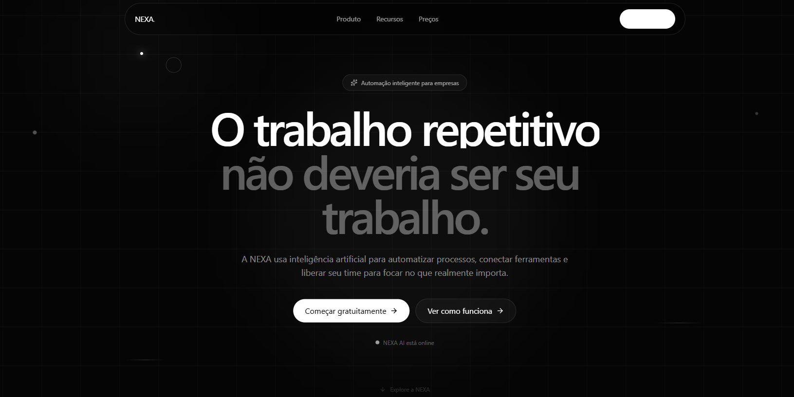
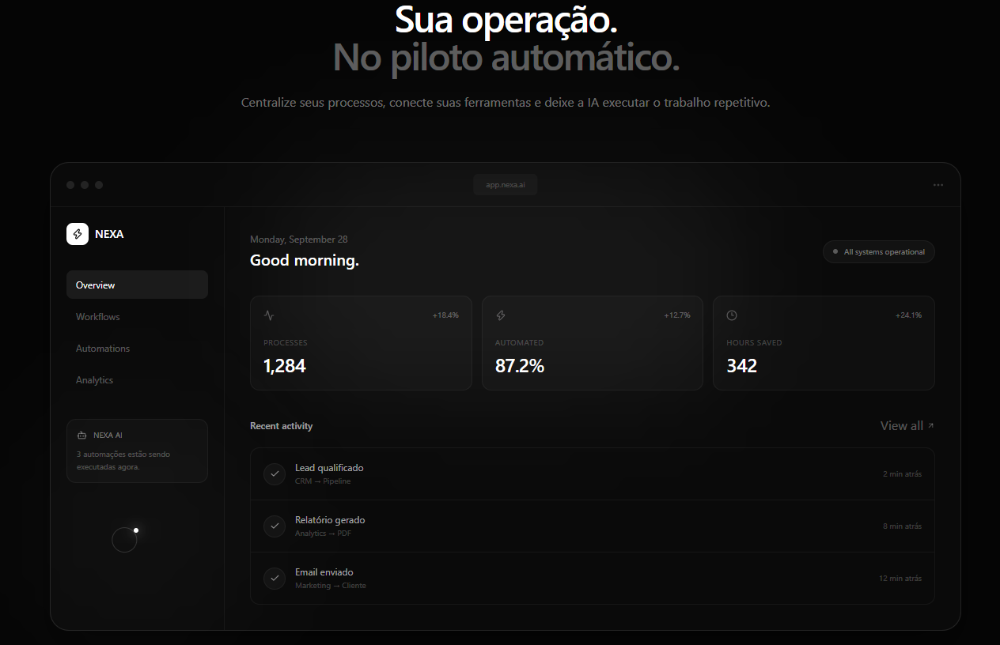
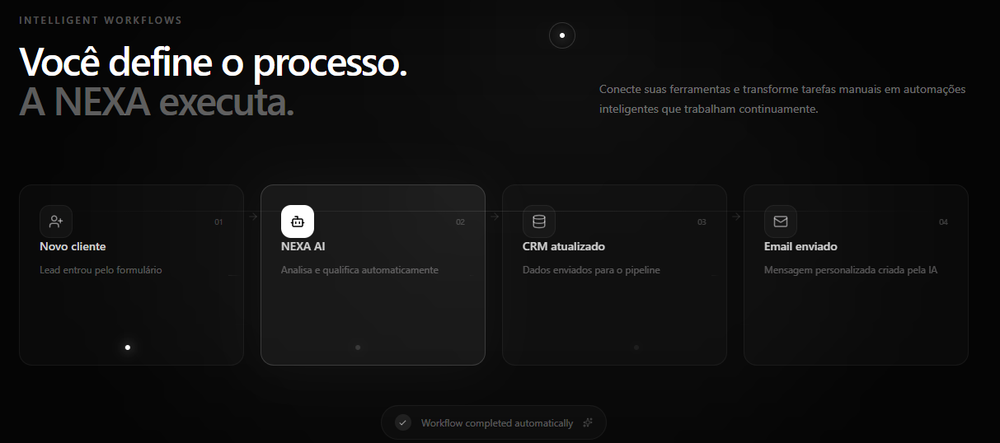
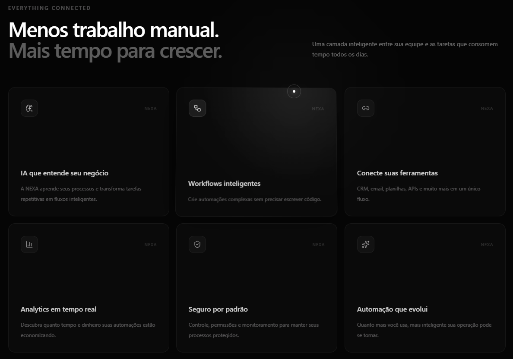
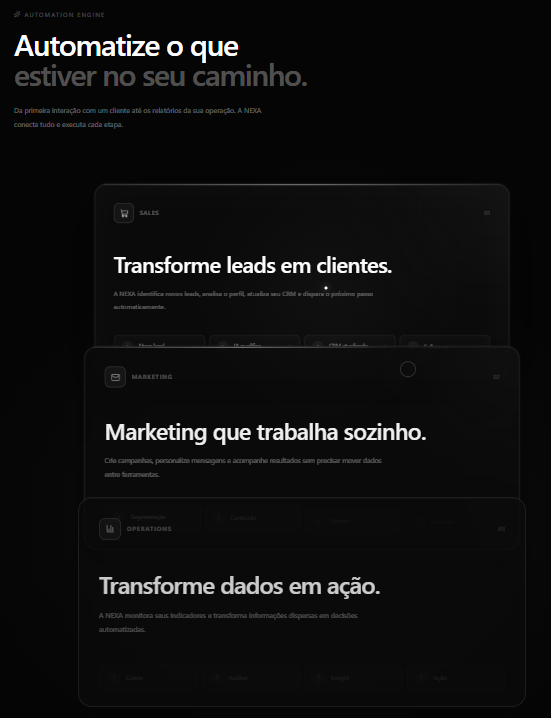
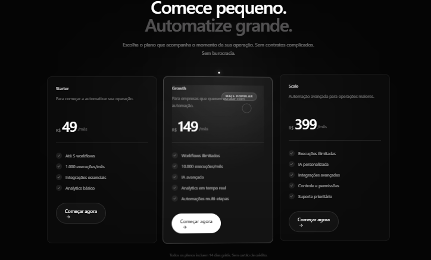
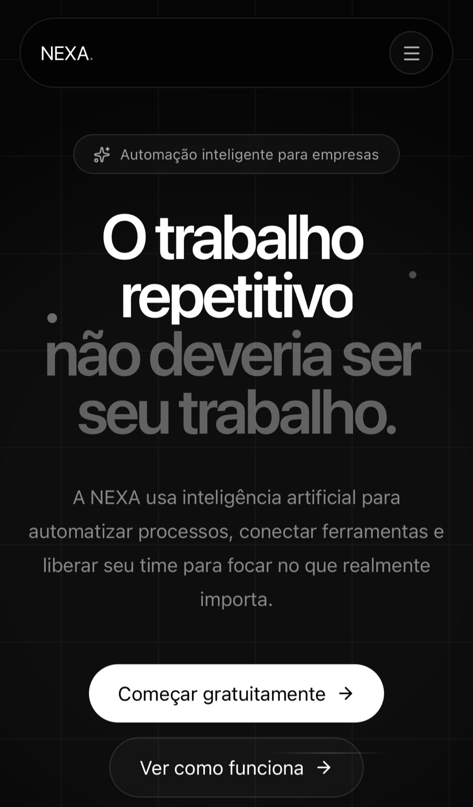
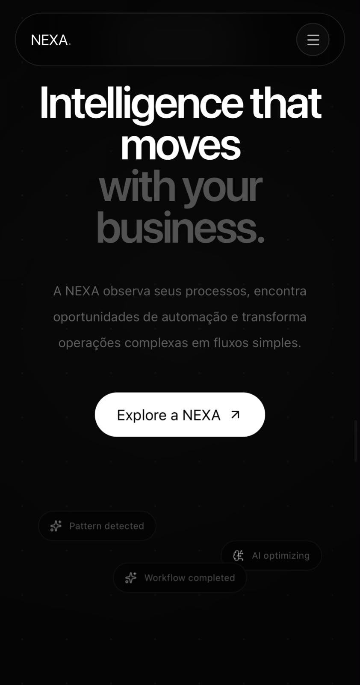

# NEXA

### Sua operação. No piloto automático.

**NEXA** é um SaaS fictício de automação inteligente criado como projeto de portfólio, com foco em **frontend moderno, design de produto, motion design e experiências digitais orientadas por IA**.

> **“O trabalho repetitivo não deveria ser seu trabalho.”**

A proposta é representar uma plataforma capaz de conectar ferramentas, transformar processos em workflows e acompanhar uma operação através de um workspace interno.

<p align="center">
  <a href="https://nexa-landing-page-fawn.vercel.app/">
    <strong>🚀 ACESSAR A NEXA →</strong>
  </a>
</p>

---

## 🌐 Live Demo

A aplicação está publicada na Vercel e inclui a landing page pública e um workspace interno demonstrativo.

### Fluxo do produto

`Landing → Login → Dashboard → Workflows / Analytics / Activity / Settings / NEXA AI`

> **Demo:** a autenticação é local e conceitual. Nenhuma credencial é enviada para um servidor.

---

## 📸 Preview

### Desktop

<p align="center"></p>
<p align="center"></p>
<p align="center"></p>
<p align="center"></p>
<p align="center"></p>
<p align="center"></p>

### Mobile

<p align="center"></p>
<p align="center"></p>

---

## ✨ O projeto

A NEXA foi construída como uma experiência SaaS premium, combinando:

- Dark UI
- Glassmorphism
- Microinterações
- Motion design
- Animações baseadas em scroll
- Parallax
- Tilt 3D
- Elementos interativos
- Componentização
- Responsividade
- Experiência mobile
- Workspace interno
- Simulação de automações

O movimento foi pensado para **guiar atenção, reforçar feedback e criar percepção de profundidade**, sem transformar a interface em uma coleção de efeitos aleatórios.

---

## 🚀 Funcionalidades

### Landing page

- Hero com parallax reativo
- Product Showcase
- Workflows conceituais
- Features interativas
- Automation Showcase com scroll-driven animations
- Intelligence section
- Pricing
- CTA final
- Footer interativo
- Navegação responsiva

### Dashboard

O workspace interno possui:

- Overview
- Workflows
- Analytics
- Activity
- Settings
- NEXA AI
- Métricas da operação
- Histórico de execuções
- Navegação responsiva

### Workflow Simulator

A área de Workflows permite:

- Escolher entre automações
- Executar etapas sequencialmente
- Visualizar progresso
- Reiniciar execuções
- Registrar execuções concluídas
- Persistir histórico no `localStorage`
- Exibir execuções recentes na Activity

> A execução é uma **simulação local**. Não existem APIs externas conectadas aos workflows.

### NEXA AI

A página NEXA AI representa conceitualmente a camada de inteligência do produto.

Atualmente funciona em **Demo Mode**, utilizando dados locais.

A integração com uma API real de IA permanece como evolução futura.

### Autenticação conceitual

O projeto possui o fluxo:

```text
Landing
   ↓
Login
   ↓
Dashboard
   ↓
Logout
```

As rotas `/dashboard/*` são protegidas por uma sessão local armazenada no navegador.

> Isso não é autenticação de produção. O objetivo é demonstrar arquitetura e experiência de acesso.

---

## ✨ Motion & Interações

- Hero com parallax reativo ao mouse
- Spotlight global
- Cursor trail
- Spotlight individual nos cards
- Tilt 3D
- Microinterações em botões
- Navbar com estado ativo
- Métricas com count-up
- Conexões animadas entre workflows
- AI Orb interativa
- Aurora background
- Progress bar de scroll
- Reveals cinematográficos
- Automation Showcase controlado por scroll
- CTA final cinematográfico
- `prefers-reduced-motion`

---

## 📱 Responsividade

A interface recebeu ajustes específicos para desktop e mobile e foi testada em dispositivo móvel real.

Incluindo:

- Navbar mobile
- Pricing cards
- Tipografia responsiva
- CTA final
- AI Orb
- Espaçamentos
- Elementos gráficos
- Overflow horizontal
- Interações adaptadas para touch

---

## 🏗️ Arquitetura

```text
src/
│
├── components/
│   ├── AIOrb.tsx
│   ├── AuroraBackground.tsx
│   ├── Button.tsx
│   ├── CursorTrail.tsx
│   ├── GlobalSpotlight.tsx
│   ├── Navbar.tsx
│   ├── ScrollProgress.tsx
│   ├── SplitText.tsx
│   └── SpotlightCard.tsx
│
├── pages/
│   ├── Activity.tsx
│   ├── AI.tsx
│   ├── Analytics.tsx
│   ├── Dashboard.tsx
│   ├── Login.tsx
│   ├── Settings.tsx
│   └── Workflows.tsx
│
├── sections/
│   ├── AutomationShowcase.tsx
│   ├── Features.tsx
│   ├── FinalCTA.tsx
│   ├── Footer.tsx
│   ├── Hero.tsx
│   ├── Intelligence.tsx
│   ├── Pricing.tsx
│   ├── ProductShowcase.tsx
│   └── Workflow.tsx
│
├── App.tsx
├── index.css
└── main.tsx

tests/
└── smoke.test.mjs
```

---

## 🛠️ Stack

- **React**
- **TypeScript**
- **Vite**
- **Tailwind CSS v4**
- **Motion**
- **GSAP + ScrollTrigger**
- **Lucide React**
- **Node.js / npm**
- **Git / GitHub**
- **Vercel**

---

## 🎨 Design System

| Elemento | Direção |
| --- | --- |
| Background | Preto / grafite |
| Tipografia | Sans-serif moderna |
| Contraste | Branco / tons de cinza |
| Cards | Glassmorphism |
| Bordas | Baixo contraste |
| Sombras | Suaves |
| Animações | Sutis e fluidas |
| Espaçamento | Generoso |
| Layout | Minimalista |
| Destaques | Glow e profundidade |

---

## 💰 Pricing

| Plano | Preço |
| --- | ---: |
| Starter | R$ 49/mês |
| Growth | R$ 149/mês |
| Scale | R$ 399/mês |

> Preços, funcionalidades e métricas são fictícios e existem exclusivamente para o conceito visual do projeto.

---

## 🧪 Testes e qualidade

O projeto possui:

- Smoke tests automatizados
- Build de produção com TypeScript + Vite
- Validação de rotas
- Testes de responsividade
- Testes em dispositivo móvel real
- Verificação de overflow
- Validação de microinterações
- `prefers-reduced-motion`

### Comandos

```bash
npm run build
npm test
npm run lint
```

---

## 💻 Como executar localmente

### Clone

```bash
git clone https://github.com/LucaswBohrer/nexa-landing-page.git
cd nexa-landing-page
```

### Instale

```bash
npm install
```

### Desenvolvimento

```bash
npm run dev
```

### Build

```bash
npm run build
```

### Testes

```bash
npm test
```

### Preview

```bash
npm run preview
```

---

## 🗺️ Roadmap

### Concluído

- [x] Deploy público — Vercel
- [x] Screenshots oficiais
- [x] Favicon personalizado
- [x] Open Graph image
- [x] Página interna do dashboard
- [x] Simulação funcional de workflows
- [x] Sistema de autenticação conceitual
- [x] Testes automatizados

### Futuro

- [ ] Integração com API de IA
- [ ] Autenticação real com backend
- [ ] Persistência em banco de dados
- [ ] Integrações reais com ferramentas externas
- [ ] Testes E2E
- [ ] Observabilidade e analytics reais

> A integração real de IA foi deixada propositalmente para uma etapa futura. Atualmente, a NEXA AI permanece em modo demonstrativo.

---

## 🎯 Objetivo

A NEXA foi desenvolvida como um projeto de **portfólio**, demonstrando conhecimentos em:

- Desenvolvimento frontend
- React
- TypeScript
- Tailwind CSS
- Motion design
- GSAP
- UX/UI
- Design de interfaces SaaS
- Componentização
- Responsividade
- Git e GitHub
- Arquitetura de aplicações frontend
- Experiência do usuário

Mais do que uma landing page, o projeto explora como **design, movimento e tecnologia podem trabalhar juntos para comunicar um produto digital**.

---

## 👨‍💻 Autor

**Lucas Bohrer**

Estudante de Engenharia Elétrica e desenvolvedor interessado em:

- Software
- Inteligência Artificial
- Automação
- Desenvolvimento Web
- Sistemas embarcados
- Experiências digitais

### Links

- GitHub: [@LucaswBohrer](https://github.com/LucaswBohrer)
- Projeto: [NEXA](https://github.com/LucaswBohrer/nexa-landing-page)

---

## 📄 Licença

Este projeto foi desenvolvido para fins de **portfólio e estudo**.

O conceito, identidade visual e conteúdo da NEXA são fictícios.

---

<p align="center">
  Desenvolvido com React, TypeScript, Tailwind CSS, Motion e GSAP.
</p>

<p align="center">
  <strong>NEXA — Sua operação. No piloto automático.</strong>
</p>
